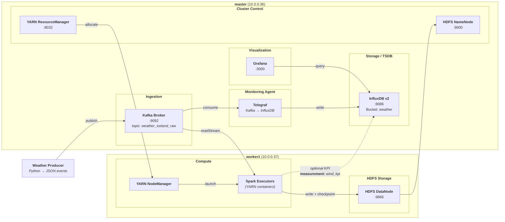

# Big Data Weather Pipeline (Kafka + Spark + HDFS + InfluxDB + Grafana)

## 1. Project Title & Overview

### 1.1 Context & Motivation

Weather data is time-sensitive and naturally suited for streaming systems: new measurements arrive continuously, and users often care about **near real-time visibility** (e.g., wind gust alerts, temperature trends, or pressure changes).  
This project was built as a hands-on Big Data exercise to demonstrate how a modern pipeline can ingest raw events, store them reliably, and make them observable through monitoring dashboards.


### 1.2 Objectives
- Ingest raw weather events from Kafka (Iceland weather)
- Provide two **stable, demo-ready** pipelines:
  1) **Data Lake / Batch line (HDFS)**: Spark processes the stream and persists results to HDFS 
  2) **TSDB / Visualization line (InfluxDB + Grafana)**: Telegraf consumes Kafka and writes to InfluxDB, visualized in Grafana dashboards

> Note (about the KPI line): the project originally includes a third pipeline:  
> **Spark Structured Streaming → compute wind KPIs → write to InfluxDB (measurement = `wind_kpi`)** (`scripts/kpi.sh` + `src/spark/spark_kpi_to_influx.py`).  
> On low-resource 2-VM setups, this line may become unstable due to YARN AM container contention and HDFS staging writes, which can trigger DataNode slow acks/timeouts or VM lockups.  
> Therefore, the KPI line is **kept (code + documentation)** but **not required for the final demo**. Later sections explain reproducibility, failure mode, and mitigations attempted.

### 1.3 Architecture
- **Kafka topic**: `weather_iceland_raw` 
- **TSDB line**  
  `Kafka (weather_iceland_raw) → Telegraf (kafka_consumer) → InfluxDB (bucket=weather, measurement=weather_forecast) → Grafana dashboards`
- **HDFS line**  
  `Kafka → Spark on YARN → HDFS (outputs/checkpoints/artifacts)`



### 1.4 Repository Layout (Code & Config)

This repository is organized around **runnable scripts**, **layered configuration**, and **portable monitoring assets**.

#### i. Entry scripts (run everything from `scripts/`)
- `scripts/pipeline.sh` — **main data pipeline** (Kafka → Spark on YARN → HDFS)
- `scripts/tsdb.sh` — **TSDB / monitoring line** (Telegraf → InfluxDB → Grafana)
- `scripts/kpi.sh` — **optional KPI pipeline** (Spark Structured Streaming → InfluxDB); may be unstable on **low-resource VMs**
- `scripts/_load_env.sh` — **central env loader** used by scripts (loads `config/pipeline.env` then `env/local.env`)
- `scripts/telegraf_sync.sh` — **deploy Telegraf configuration** from the repository to the system service
- `scripts/healthcheck.sh` — **sanity checks** for Kafka / HDFS / YARN / InfluxDB / Grafana readiness

#### ii. Configuration layering (avoid committing secrets)
- `config/pipeline.env` — **project defaults** (safe to commit; shared config)
- `env/local.env` — **machine-specific overrides + secrets** (do **not** commit; e.g., tokens, SSH hosts)

#### iii. Monitoring & visualization assets (portable)
- `config/telegraf/weather_kafka.conf` — Telegraf **Kafka → InfluxDB** input/output config
- `config/grafana/*.json` — exported Grafana dashboards (**portable JSON exports**)
- `docs/monitoring/*.png` — dashboard screenshots (**submission evidence** / reproducibility proof)

## 2. Dependencies (Software Versions)
Below are the **exact versions** used in my environment (as verified on the cluster):

- **OS**: Ubuntu (Azure VM)
- **Java**: OpenJDK **17.0.17**
- **Python**: **3.12.3**
- **Hadoop**: **3.3.6** (`/usr/local/hadoop`)
- **Spark**: **3.5.7** (`spark-3.5.7-bin-hadoop3`, Scala **2.12.18**)
- **Kafka**: **3.7.0**
- **InfluxDB CLI**: **Influx CLI dev** (build date **2024-04-16**)  
  > InfluxDB server is **InfluxDB v2** (the project uses the v2 API / token / org / bucket).
- **Telegraf**: **1.37.0**
- **Grafana**: **12.3.1**

### 2.1 Python dependencies

Python packages are defined in `requirements.txt`.

Install:
```bash
python3 -m venv .venv
source .venv/bin/activate
pip install -r requirements.txt
```

## 3. Cluster Setup Instructions

This project runs on a small 2-node Hadoop/Spark/Kafka cluster (**master + 1 worker**). The setup is optimized for low-resource VMs, so the optional **KPI (Spark → InfluxDB)** line may become unstable if the cluster is under memory/disk pressure.  
The two validated paths in this repo are:

- **HDFS pipeline** (Kafka → Spark Streaming → HDFS)
- **TSDB pipeline** (Kafka → Telegraf → InfluxDB → Grafana)

The configuration is layered to keep secrets out of Git:
- `config/pipeline.env` (**committed**): project defaults
- `env/local.env` (**NOT committed**): machine-specific values + secrets (tokens, SSH hosts, etc.)

### 3.1 Nodes and Roles

| Node | Hostname | IP | Roles |
|------|----------|----|------|
| master | `master` | `10.0.0.36` | Kafka broker, HDFS NameNode, YARN ResourceManager, InfluxDB v2, Grafana |
| worker1 | `worker1` | `10.0.0.37` | HDFS DataNode, YARN NodeManager, Spark executors |

> Notes  
> - Spark jobs are submitted to **YARN** (ResourceManager on master) and executed as containers (typically on worker1).  
> - HDFS writes require at least one healthy DataNode (worker1). If the DataNode is down or unstable, Spark submissions may fail because YARN stages Spark artifacts to HDFS (`.sparkStaging/`).

### 3.2 Configuration

> Assume you are on **master**.  
> This project is **script-driven**: run everything from `scripts/`.

#### Configuration layering

| Layer | File | Purpose | VCS |
|---|---|---|---|
| Defaults | `config/pipeline.env` | Project defaults | committed |
| Overrides | `env/local.env` | Machine-specific overrides + secrets | NOT committed |

#### Versioned service configuration (committed under `config/`)

| Component | Files / Folders |
|---|---|
| Grafana dashboards | `config/grafana/cluster_monitoring.json`<br/>`config/grafana/weather_forecast.json` |
| Hadoop / HDFS / YARN | `config/hadoop/core-site.xml`<br/>`config/hadoop/hdfs-site.xml`<br/>`config/hadoop/mapred-site.xml`<br/>`config/hadoop/yarn-site.xml` |
| Kafka + ZooKeeper | `config/kafka/server.properties`<br/>`config/kafka/zookeeper.properties` |
| Spark | `config/spark/` |
| Telegraf (Kafka → InfluxDB) | `config/telegraf/weather_kafka.conf` |

> Note: scripts load env values (IPs, ports, tokens, paths) from `pipeline.env` + `local.env`,  
> while the **service-level config files** above stay portable and committed.

### 3.3 Full demo sequence 

```bash
# Load environment
cd ~/BigData
source ./scripts/_load_env.sh
./scripts/telegraf_sync.sh

# 1) Start monitoring (Grafana/Influx/Telegraf)
./scripts/tsdb.sh start

# 2) Start main pipeline
./scripts/pipeline.sh start

# 3) Observe
./scripts/pipeline.sh status
./scripts/tsdb.sh status

# 4) Stop everything (end of demo)
./scripts/pipeline.sh stop
./scripts/tsdb.sh stop

```

> Azure VM Note (possible ephemeral `/mnt`): On many Azure VM images, `/mnt` may be backed by an ephemeral/temporary disk. Depending on the VM type/image and how storage is mounted, data under `/mnt` can be cleared or remounted after reboot/stop-start, which can break a pipeline that stores HDFS/YARN local data there. Symptoms often look like Hadoop daemons failing to start, “no live datanodes”, missing local dirs, or a DataNode clusterID mismatch .\
> If you hit a similar situation, the typical recovery is to re-initialize the HDFS storage on that node: stop Hadoop, remove the stale NameNode/DataNode local data directories, format the NameNode (only if you’re OK losing the existing HDFS contents), then restart HDFS/YARN so all nodes register against the same clusterID. 

## 4 Monitoring - How to Access UIs (Hadoop / YARN / InfluxDB / Grafana)
All web UIs are exposed from the **master** node.

If you are **not** on the same network as the cluster (typical Azure VM setup), use SSH port-forwarding
from your **local laptop** to access the UIs in a browser (`http://localhost:<PORT>`).

> Replace the host with your master public DNS:  
> `adm-mcsc@esilv-mcscin5a1825-0030.westeurope.cloudapp.azure.com`

---

### 4.1 YARN ResourceManager

- Cluster URL (internal): `http://10.0.0.36:8088`
- Local access (SSH forward):

```bash
ssh -NT -L 8088:10.0.0.36:8088 adm-mcsc@esilv-mcscin5a1825-0030.westeurope.cloudapp.azure.com
# Open in browser: http://localhost:8088
```

### 4.2 HDFS NameNode UI
- Cluster URL (internal): `http://10.0.0.36:8086`
- Local access (SSH forward):

```bash
ssh -NT -L 8086:10.0.0.36:8086 adm-mcsc@esilv-mcscin5a1825-0030.westeurope.cloudapp.azure.com
# Open in browser: http://localhost:8086
```

### 4.3 Grafana
- Cluster URL (internal): `http://10.0.0.36:3000`
- Local access (SSH forward):

```bash
ssh -NT -L 3000:10.0.0.36:3000 adm-mcsc@esilv-mcscin5a1825-0030.westeurope.cloudapp.azure.com
# Open in browser: http://localhost:3000
```
**Dashboards / evidence:**\
Exported dashboards: `config/grafana/*.json`\
Screenshot evidence: `docs/monitoring/*.png`

## 5. Demo video link
https://youtu.be/7CJbVqzJ-gU?si=VvSZh7qCo_xOPKoO